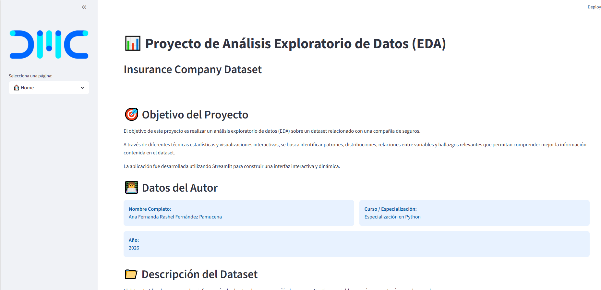
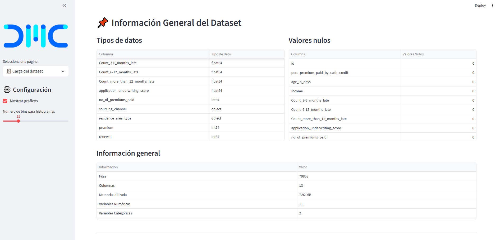
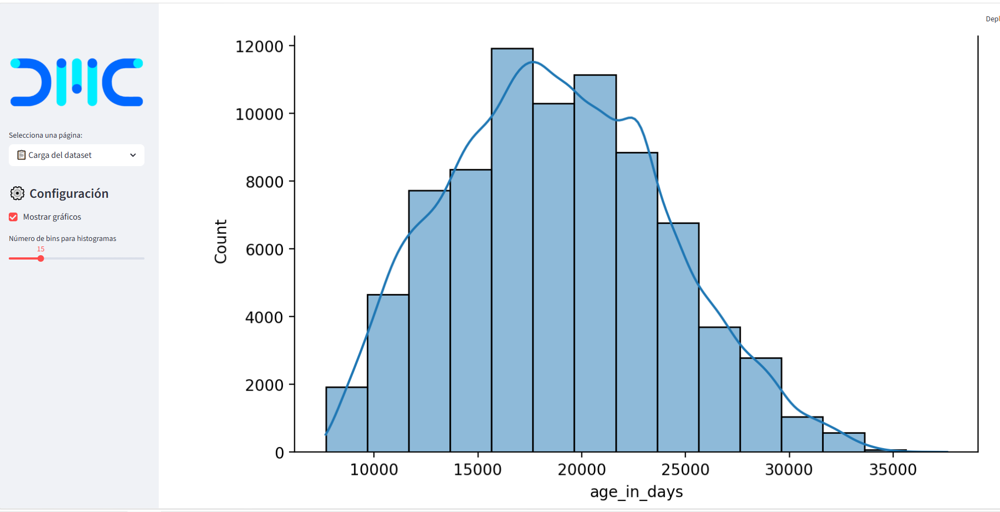
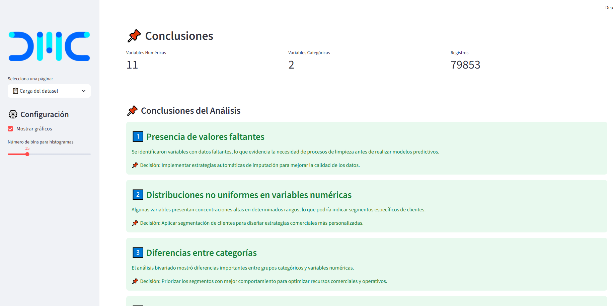

# MiAplicacionCaso3
# 📊 Insurance Company Analysis - EDA Application


---

# 🚀 Descripción del Proyecto

**Insurance Company Analysis - EDA Application** es una aplicación interactiva
desarrollada con **Python** y **Streamlit** para realizar un
**Análisis Exploratorio de Datos (EDA)** sobre información de clientes
y servicios de una compañía de seguros.

La aplicación permite analizar variables relacionadas con clientes,
planes de seguros, costos, reclamos y comportamiento general,
con el objetivo de identificar patrones relevantes para la toma
de decisiones empresariales.

El proyecto está enfocado en:

- Limpieza y transformación de datos
- Análisis estadístico
- Visualización interactiva
- Identificación de patrones comerciales
- Comprensión del comportamiento de clientes
- Soporte a la toma de decisiones

El objetivo principal NO es construir modelos predictivos,
sino desarrollar una herramienta analítica funcional,
visual y organizada.

---

# 📈 Funcionalidades Principales

✅ Carga dinámica de archivos CSV  
✅ Limpieza y preparación de datos  
✅ Clasificación automática de variables  
✅ Estadísticas descriptivas  
✅ Análisis de valores nulos  
✅ Histogramas y gráficos categóricos  
✅ Análisis bivariado  
✅ Dashboard interactivo con Streamlit  
✅ Hallazgos clave orientados al negocio  

---

# 📷 Capturas de la Aplicación

## 🏠 Home



---

## 📊 Información General del Dataset



---

## 📈 Distribución de Variables



---

## 📌 Hallazgos Clave



---

# ⚙️ Tecnologías Utilizadas

- Python
- Streamlit
- Pandas
- NumPy
- Matplotlib
- Seaborn


# 🛠️ Streamlit

## 1️⃣ Enlace de aplicativo

```bash
link 
